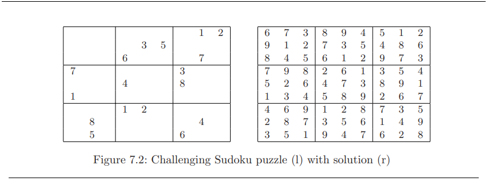

What is Sudoku? In its most common form, it consists of a 9×9 grid filled with
blanks and the digits 1 to 9. The puzzle is completed when every row, column, and
sector (3×3 subproblems corresponding to the nine sectors of a tic-tac-toe puzzle)
contain the digits 1 through 9 with no deletions or repetition. Figure 7.2 presents
a challenging Sudoku puzzle and its solution.
Backtracking lends itself nicely to the problem of solving Sudoku puzzles. We
will use the puzzle here to better illustrate the algorithmic technique. Our state
space will be the sequence of open squares, each of which must ultimately be filled
in with a number. The candidates for open squares (i,j) are exactly the integers
from 1 to 9 that have not yet appeared in row i, column j, or the 3 × 3 sector
containing (i,j). We backtrack as soon as we are out of candidates for a square.
The solution vector a supported by backtrack only accepts a single integer
per position. This is enough to store contents of a board square (1-9) but not the
coordinates of the board square. Thus, we keep a separate array of move positions
as part of our board data type provided below. The basic data structures we need
to support our solution are: