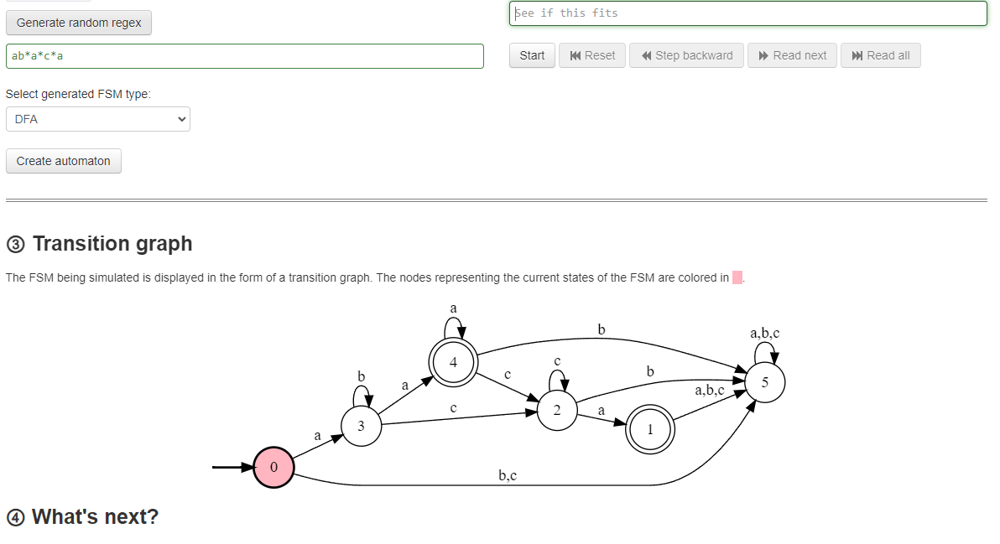

# 10. Regular Expression Matching

## Changelog

* Started this problem on Aug 9, 2024

## Problem overview

If we reduce the scope of the problem to just matching two strings, e. g. string 'aa' matches pattern string 'aa', but 'aaa' or 'a' doesn't, we get a more simple problem of comparing two strings (`strcmp()` from standard C library). `.` wildcard is also a trivial addon for this problem, the real issue is with the `*` asterisk wildcard or *Kleene Star*.

Let's build intuition behind matching `*` wildcard by taking a simple example of `s = 'aa', p = 'a*'`. We can accomplish this task by a simple while loop where we iterate over `string` and `pattern` using two pointers `i`, `j` and look for the end of the `string`. Next example is `s = 'aabb', p = 'a*b*'` where we use the same logic as in the next snippet.

```c
bool isMatch(char *s, char *p)
{
    int slen = (int)strlen(s), plen = (int)strlen(p);
    int isMatch = 1;
    int i = 0, j = 0;
    
    while (i < slen)
    {
        if (j >= plen) {
            isMatch = false;
            break;
        }
        if (j < (plen - 1) && p[j + 1] == '*') {
            if (s[i] != p[j] && p[j] != '.') {
                j = j + 2;
                continue;
            } else {
                i = i + 1;
                continue;
            }
        }
        if (s[i] != p[j] && p[j] != '.') {
            isMatch = false;
            break;
        }
        i++;
        j++;
    }
    if (j < plen && p[plen - 1] != '*') {
        isMatch = false;
    }
    return isMatch;
}
```

But it passes only a number of test cases and gets stuck on these ones

* FAIL    Input: s = "a", p = ".\*..a\*"    Expected: false
* FAIL    Input: s = "aaa", p = "ab\*a\*c\*a"        Expected: true
* FAIL    Input: s = "abcdede", p = "ab.\*de"      Expected: true
* FAIL    Input: s = "aaa", p = "a\*a"     Expected: true
* FAIL    Input: s = "bbbba", p = ".\*a\*a" Expected: true

## Implementation



## Resources

* [Regular expression to DFA | GeeksforGeeks](https://www.geeksforgeeks.org/regular-expression-to-dfa/)
* [Thompson construction algorithm step by step | Medium](https://medium.com/swlh/visualizing-thompsons-construction-algorithm-for-nfas-step-by-step-f92ef378581b)
* [Visualizing Regex to DFA/NFA/eNFA](https://ivanzuzak.info/noam/webapps/fsm_simulator/)
* Fundamental thing [Regular Expression Matching Can Be Simple And Fast(but is slow in Java, Perl, PHP, Python, Ruby, ...)](https://swtch.com/~rsc/regexp/regexp1.html)
* [YOUTUBE: Low Byte Productions: How Do Regular Expressions Really Work?](https://youtu.be/u01jb8YN2Lw)
* [YOUTUBE: clumsy computer: Coding a regex engine from scratch with no imports in Python! (From Scratch #1)](https://youtu.be/fgp0tKWYQWY)
* [Implementing a Regular Expression Engine](https://deniskyashif.com/2019/02/17/implementing-a-regular-expression-engine/)
* [Backtracking Algorithms](https://www.abhinavpandey.dev/blog/backtracking-algorithms)
