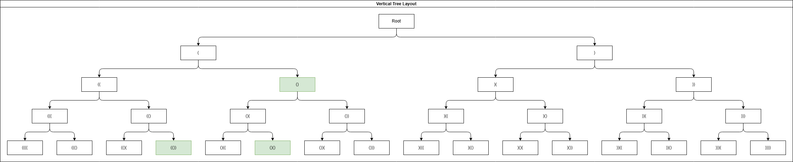
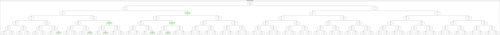

## resources

<!-- * [Regular expression to DFA | GeeksforGeeks](https://www.geeksforgeeks.org/regular-expression-to-dfa/) -->

## implementation
1. Construct a decision tree of choosing left or right parentheses
2. Backtrack if ___ condition?

## Tree representation of n = 2 

## Tree representation of n = 3 

