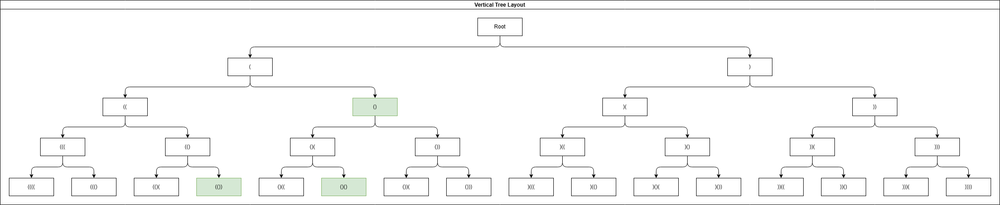
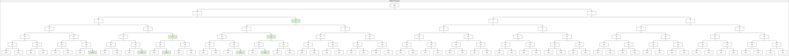

# 22. Generate Parentheses

## Problem overview

For this problem we should use recursive backtracking algorithm to generate valid parentheses. First, let's think why this problem is recursive and why is searching involved in it by going back to problem *20 Valid Parentheses*. That problem required us to check if given string of parentheses were valid, and we did it by pushing in a stack all open parentheses `(` and matching them with the close ones as we stumbled upon them. Here we should generate (print, insert into an array) valid parentheses given the number `n`, so, for example for `n = 1` we have only one solution `()`, for `n = 2` we have two solutions `()(), (())` which gives us intuiton for what we should have in output eventually - *a string of length `2n`* and *the number of open and close parentheses are equal*.

We will see what we can do with that information, but let's think how many ways are there to generate one or two any (even not valid) pairs of parentheses, here's what we might get (`n` is given number of valid pair of parentheses and `m` is the number of possible combinations):

* $n = 1;  m = (2^{2n}) = 2^2 = 4$:
  * `((`, `()`, `)(`, `((`
* $n = 2;  m = (2^{2n}) = 2^4 = 16$:
  * `((((`, `((()`, `(()(`, `(())`, `()((`, `()()`, `())(`, `()))`, `)(((`, `)(()`, `)()(`, `)())`, `))((`, `))()`, `)))(`, `))))`

The visualization of these combinations are represented in the following binary tree graph, where we start from the root as an empty subset (string) and continue by adding i. e. choosing either an open or close parenthesis on each step:



This is what's called [Cartesian Product](https://en.wikipedia.org/wiki/Cartesian_product) of two sets, namely set $A=\{x, y\}$ and $B=\{x, y\}$ where x = `(`  and  y = `)`. Regarding our problem, the cartesian product will be repeated $2n$ times, so for $n = 1$ we will repeat two times: $A\times B = \{`((`, `()`, `)(`, `((`\}$ , then we would take the resulting output and calculate the cartesian product of it with set $A=\{ `(`, `)` \}$ and so on. It is now that we see the ***recursive*** nature of the problem, as for calculating $n = 3$ we need the result of $n = 2$ and for that the result of $n = 1$, which would be the base case.

Let's focus on a function which would calculate cartesian product recursively, for reference we will use function [itertools.product()](https://docs.python.org/3/library/itertools.html#itertools.product) in Python, and [Rosetta Code sample](https://rosettacode.org/wiki/Cartesian_product_of_two_or_more_lists#C) in C language. For our examples we will use Python as a pseudocode substitute, and here is a lightweight `cart_product()` function which takes two sets as parameters and returns a set with cartesian product of those sets as a result.

```python
def cart_product(set_a: list[str], set_b: list[str]) -> list[str]:
    set_result = []
    for elem_a in set_a:
        for elem_b in set_b:
            set_result.append(''.join([elem_a, elem_b]))
    return set_result

>>> set_a = ['(',')']
>>> set_b = ['(',')']
>>> cart_product(set_a=set_a, set_b=set_b)
['((', '()', ')(', '))']

```

## Implementation

For now we are sure that the solution implies recursive backtracking, so let's describe in detail each step of the implementation. Let's implement the solution following Skiena's template described in Algorithm Design Manual:

```c
void backtrack(int a[], int k, data input)
{
    int c[MAXCANDIDATES];                               /* candidates for next position */
    int ncandidates;                                    /* next position candidates count */
    int i;                                              /* counter */

    if (is_a_solution(a, k, input))
        process_solution(a, k, input);
    else {
        k = k + 1;
        construct_candidates(a, k, input, c, &ncandidates);
        for (i = 0; i < ncandidates; i++) {
            a[k] = c[i];
            make_move(a, k, input);
            backtrack(a, k, input);
            unmake_move(a, k, input);
            if (finished) return;                       /* terminate early */
        }
    }
}
```

* **construct_candidates()**
  * candidates are `(`, `)`

## Tree representation of n = 3


