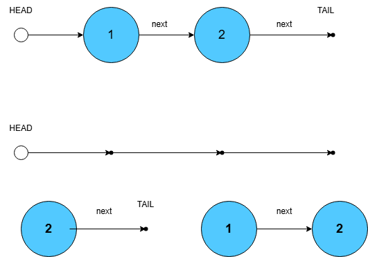

# 24. Swap Nodes in pairs

## Problem overview

For starters to this point as for April, 2025 I haven't solved yet the problem of reversing a Linked List using recursion despite taking multiple attempts at it, which helped me to grasp the idea of recursion in linked lists by writing [`printList`](./../../concepts/templates/mk_linkedlist.h#:~:text=printList) function. So preliminaries for this problem should be this step. Let's take the following linked list **->1->2** where the output should be **->2->1**, where we are required to use recursion. Recursion in linked lists are represented in a way where a node always points to another linked list. If we take our example and the first node **->1** it points to a linked list with its HEAD pointed to **2**. In this example we need them swapped as we would do it with chars for example.

```c
char a, b;
char temp = a;
a = b;
b = temp;
```

```c
struct ListNode* temp;
temp = head;
temp->next = head->next->next;
head = head->next;
head->next = temp;
```

Here is a visualization of this swapping which works for **->1->2** and really returns a reversed list **->2->1** but changes in place the original list to just **->1**. And it for sure doesn't work for lists with three or more nodes.



Now the next visualization is for three nodes **->1->2->3** and we clearly see that just swapping doesn't work here as if we swap 2 with 3 in first step and get **->1->3->2**, then in the next recursive call we swap 1 with 3 and get **->3->1->2** which is not what we initially wanted to get.


## Implementation

## Resources
