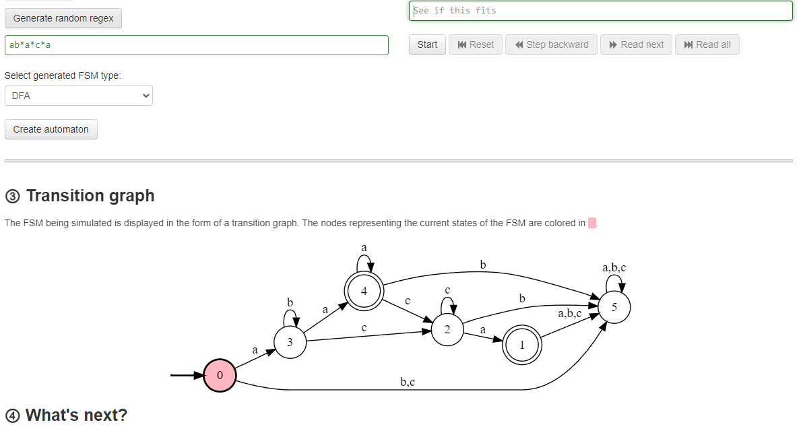

## resources

* [Regular expression to DFA | GeeksforGeeks](https://www.geeksforgeeks.org/regular-expression-to-dfa/)
* [Thompson construction algorithm step by step | Medium](https://medium.com/swlh/visualizing-thompsons-construction-algorithm-for-nfas-step-by-step-f92ef378581b)
* [Visualizing Regex to DFA/NFA/eNFA](https://ivanzuzak.info/noam/webapps/fsm_simulator/)
* Fundamental thing [Regular Expression Matching Can Be Simple And Fast(but is slow in Java, Perl, PHP, Python, Ruby, ...)](https://swtch.com/~rsc/regexp/regexp1.html)
* [YOUTUBE: Low Byte Productions: How Do Regular Expressions Really Work?](https://youtu.be/u01jb8YN2Lw)
* [YOUTUBE: clumsy computer: Coding a regex engine from scratch with no imports in Python! (From Scratch #1)](https://youtu.be/fgp0tKWYQWY)
* [Implementing a Regular Expression Engine](https://deniskyashif.com/2019/02/17/implementing-a-regular-expression-engine/)
* [Backtracking Algorithms](https://www.abhinavpandey.dev/blog/backtracking-algorithms)

## implementation
1. Parse the regex string into tokens of states? or just patterns.
2. BACKTRACKING

## regex to DFA 

